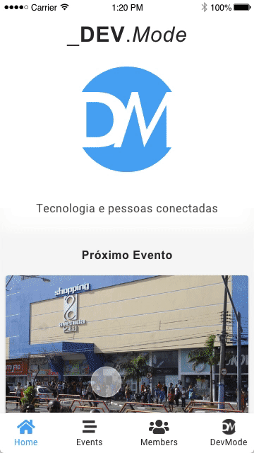
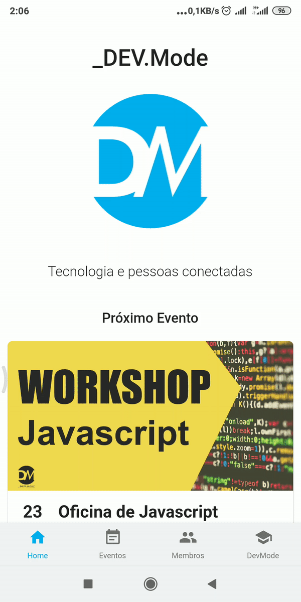

## [Potótipo de design](https://xd.adobe.com/view/e50b573b-318c-45cc-60dd-33567e1eea0a-933a/)



[Link](https://xd.adobe.com/view/e50b573b-318c-45cc-60dd-33567e1eea0a-933a/)

## Estrutura

- Home
  - Card de próximo evento
  - Cards de membros recém chegados
  - Card com fotos do último evento
- Eventos
  - Tela com listagem de eventos dividido por próximos e anteriores
  - Tela de detalhes do evento
- Membros
  - Tela de listagem de membros com busca
  - Modal com detalhes do membro
- DevMode
  - tela falando sobre a devmod

## Tarefas

[x] Criar card de próximo evento  
[x] Criar card de membro  
[ ] Criar card com fotos do último evento e adicionar na Home   
[ ] Criar tela de detalhes do evento  
[ ] Criar tela de listagem de membros com busca  
[ ] Modal com detalhes do membro 

## API Fake

**Pending events**

```
GET http://www.mocky.io/v2/5e36b203320000fd07ae3cc5
```

**Finished events**

```
GET http://www.mocky.io/v2/5e36b0333200009921ae3cc1
```

## Estágio atual:

